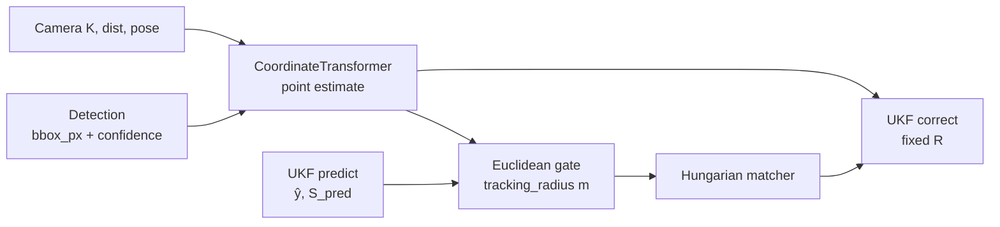

<!-- SPDX-FileCopyrightText: (C) 2026 Intel Corporation -->
<!-- SPDX-License-Identifier: Apache-2.0 -->

# ADR 12: Probabilistic Tracking Association

- **Author(s)**: [Sarat Poluri](https://github.com/spoluri)
- **Date**: 2026-06-06
- **Status**: `Proposed`
- **Related**: [ADR-0007](./0007-tracker-service.md), [ADR-0009](./0009-tracking-evaluation.md)

## TLDR

Replace Euclidean association gated by per-object `tracking_radius` with **covariance-aware Mahalanobis gating** in three phases: (1) track-side predicted uncertainty only, (2) geometry-derived per-detection measurement covariance from existing camera calibration, (3) per-measurement noise in the UKF update. Association gates become **chi-squared statistical thresholds** instead of user-defined meter radii.

## Context

SceneScape tracking uses the `robot_vision` library's `MultipleObjectTracker`, which performs predict → associate (Hungarian) → correct each frame. Today:

- **Association** uses `DistanceType.Euclidean` with a distance threshold in meters (`tracking_radius` per object class in the object library, or a fixed 2.0 m default in the tracker service).
- **State estimation** uses a multi-model UKF (CV, CA, CTRV) that already computes `predictedMeasurementMean` and `predictedMeasurementCov` after the predict step.
- **Detections** are point estimates: `CoordinateTransformer` projects bbox foot points to world coordinates using per-camera intrinsics and extrinsics from scene configuration, but emits no measurement uncertainty.

### Problems with the current approach

1. **Fixed meter gates ignore motion context.** A 2 m radius is too tight for fast movers and too loose for stationary objects. The UKF already models growing, anisotropic uncertainty during coasting — association ignores it.

2. **`tracking_radius` conflates semantics with kinematics.** Object library radius encodes "how far could this class be mis-associated," but the correct gate depends on frame interval, time since last update, velocity, and viewing geometry — information the filter and camera model already carry.

3. **Mahalanobis is implemented but unused.** `robot_vision` supports `DistanceType.Mahalanobis` and `MCEMahalanobis`, using innovation against `predictedMeasurementCov`. Production paths (controller and tracker service) explicitly select Euclidean.

4. **Camera calibration is available but underused for uncertainty.** Scene configuration already provides intrinsics, distortion, and extrinsics per camera. These are sufficient to propagate pixel-level bbox uncertainty to world-space position covariance via a first-order Jacobian through the existing undistort → pose → ground-plane pipeline.

5. **Detector confidence is available but not used for gating.** MQTT detections may include `confidence`; it flows through to track output but does not influence association or filter noise.

### Current data flow (association)



## Decision

Adopt a phased migration to probabilistic association and measurement noise, documented in [Probabilistic Tracking Implementation Plan](../design/probabilistic-tracking/plan.md).

### Phase 1 — Track-side position Mahalanobis (quick win)

- Add a **position-only** Mahalanobis distance type in `robot_vision` (2×2 block on x, y innovation; exclude size and yaw from the gate).
- Replace meter `distance_threshold` with a **chi-squared gate** (`gate_probability`, default 0.99 → χ²(2) ≈ 9.21).
- Switch tracker service and controller to the new distance type.
- Keep an optional **`max_association_radius_m`** safety ceiling for badly calibrated covariances.
- **Do not expose** per-object `tracking_radius` for association; deprecate it for tracking (retain for UI/object metadata during transition).

### Phase 2 — Geometry-derived measurement covariance

- Extend `CoordinateTransformer` to compute **world-space position covariance** Σ_xy per detection using:
  - Pixel uncertainty from bbox height and detector confidence (calibrated heuristic).
  - First-order error propagation (Jacobian) through undistort → pose → ground-plane intersection.
  - Range and incidence-angle scaling from existing camera geometry.
- Store Σ_xy on `Detection` / `TrackedObject`.
- Association uses **combined innovation covariance**: S_assoc = S_pred[xy] + R_meas[xy].
- Gate with chi-squared threshold (same global config as Phase 1).

### Phase 3 — Full probabilistic filter update

- Extend `robot_vision` to accept **per-measurement R** in the UKF correct step (not only fixed R at track initialization).
- Thread geometry-derived R through `TrackManager::setMeasurement` → `MultiModelKalmanEstimator::correct`.
- Tune global `process_noise` and `base_measurement_noise` in `tracker-config.json`; drop per-object distance configuration entirely.

### Configuration model (target)

```json
{
  "association": {
    "method": "position_mahalanobis_combined",
    "gate_probability": 0.99,
    "max_radius_m": 10.0
  },
  "measurement_uncertainty": {
    "pixel_sigma_fraction_of_bbox_height": 0.03,
    "scale_by_confidence": true,
    "min_pixel_sigma": 2.0
  },
  "filter": {
    "process_noise": 1e-4,
    "base_measurement_noise": 0.2
  }
}
```

Environment variable overrides follow existing tracker service conventions (`TRACKER_*`).

## Alternatives Considered

### 1. Keep Euclidean + per-object tracking_radius

- **Pros**: Simple operator model; already in object library and manager UI.
- **Cons**: Does not adapt to velocity, coast time, or camera geometry; theoretically inconsistent with the UKF predict step; requires per-class tuning that does not generalize.

### 2. Switch to full 7D Mahalanobis (existing `DistanceType.Mahalanobis`)

- **Pros**: Minimal code change; uses existing robot_vision enum.
- **Cons**: Gates on size dimensions with unreliable projection noise; yaw already zeroed in innovation; threshold still in meter-like units unless recalibrated; does not incorporate per-detection R.

### 3. Per-camera fixed meter radius in tracker-config.json

- **Pros**: Easier migration from object library radius.
- **Cons**: Still ignores motion and coasting; duplicates camera-specific tuning without statistical basis.

### 4. Learned per-detection covariance from the detector

- **Pros**: Best uncertainty if the model outputs it.
- **Cons**: Current SceneScape detectors do not provide localization covariance; requires model and pipeline changes outside tracker scope.

## Consequences

### Positive

- Association gates adapt to velocity, coast interval, and (Phase 2+) range/viewing angle without per-object meter tuning.
- Aligns data association with the UKF's probabilistic predict step.
- Leverages existing scene camera calibration investment.
- Phased rollout enables regression detection via HOTA, LocA, ID switches, and jitter metrics per [ADR-0009](./0009-tracking-evaluation.md).
- Removes `tracking_radius` as a tracking tuning knob (simpler object library semantics).

### Negative

- Operators lose the intuitive "N meter radius" control; replaced by statistical gate probability and calibrated pixel-sigma parameters.
- Requires robot_vision API changes (Phase 1 distance type; Phase 3 per-measurement R).
- Covariance from bbox heuristics is approximate; offline calibration (α fit) needed for best results.
- Chi-squared gates are less interpretable than meters without documentation and evaluation dashboards.
- Controller and tracker service must stay behaviorally aligned during migration.

## References

- [Probabilistic Tracking Implementation Plan](../design/probabilistic-tracking/plan.md)
- [Tracker Service Design](../design/tracker-service.md)
- [Tracking Evaluation Strategy (ADR-0009)](./0009-tracking-evaluation.md)
- [Tracker Evaluation Pipeline Design](../design/tracker-evaluation-pipeline.md)
- `controller/src/robot_vision` — `ObjectMatching`, `MultiModelKalmanEstimator`, `CoordinateTransformer`
- `tracker/src/coordinate_transformer.cpp` — pixel-to-world projection pipeline
