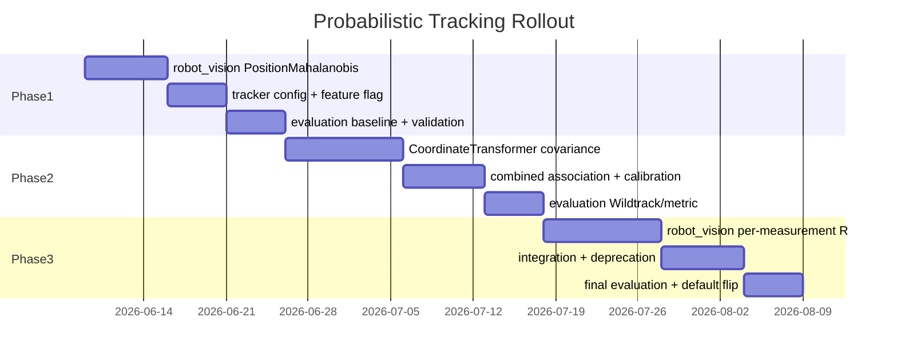

<!-- SPDX-FileCopyrightText: (C) 2026 Intel Corporation -->
<!-- SPDX-License-Identifier: Apache-2.0 -->

# Implementation Plan: Probabilistic Tracking Association

- **Author(s)**: [Sarat Poluri](https://github.com/spoluri)
- **Date**: 2026-06-06
- **Status**: `Proposed`
- **ADR**: [ADR-0012: Probabilistic Tracking Association](../../adr/0012-probabilistic-tracking-association.md)
- **Evaluation baseline**: [ADR-0009](../../adr/0009-tracking-evaluation.md), [Tracker Evaluation Pipeline](../tracker-evaluation-pipeline.md)

---

## Overview

This plan implements the three phases defined in ADR-0012. Each phase is independently shippable behind a feature flag, validated against the existing tracker evaluation pipeline before the next phase begins.

### Success criteria (all phases)

| Metric | Tool | Regression threshold (initial) |
|--------|------|--------------------------------|
| HOTA | TrackEval | ≥ baseline − 2% |
| AssA (association) | TrackEval | ≥ baseline − 3% |
| LocA | TrackEval | ≥ baseline − 2% |
| ID switches | TrackEval | ≤ baseline + 5% |
| RMS jerk / jitter | DiagnosticEvaluator | ≤ baseline + 10% |
| Unit / service tests | `make test-unit`, `make test-service` | All pass |
| Line / branch coverage | tracker CI | ≥ existing thresholds |

Capture **baseline metrics on `main`** with current Euclidean + fixed threshold before Phase 1 merges.

### Feature flag

Add to `tracker-config.json` and controller tracker config:

```json
{
  "association": {
    "method": "position_mahalanobis",
    "gate_probability": 0.99,
    "max_radius_m": 10.0
  }
}
```

| Method | Meaning |
|--------|---------|
| `euclidean` | Legacy meter gate (opt-out / rollback) |
| `position_mahalanobis` | Phase 1 default — track-side S_pred gate |
| `position_mahalanobis_combined` | Phase 2+ (S_pred + R_meas) |

---

## Phase 1 — Track-side position Mahalanobis

**Goal:** Use UKF predicted covariance for association; replace meter thresholds with chi-squared gating. No measurement covariance yet.

### 1.1 robot_vision changes

| Task | Location | Notes |
|------|----------|-------|
| Add `DistanceType::PositionMahalanobis` | `ObjectMatching.hpp/.cpp` | 2×2 block on (x,y); innovation = z_xy − ŷ_xy |
| Chi-squared gate helper | `ObjectMatching.cpp` or `Utils.hpp` | `threshold = chi2_inv(gate_probability, df=2)` |
| Keep `max_radius_m` as hard ceiling | `ObjectMatching.cpp` | Reject pair if Euclidean xy > max_radius_m regardless of Mahalanobis |
| Velocity-aligned kinematic process noise | `MultiModelKalmanEstimator.cpp` | Δt-scaled along-track ≫ cross-track Q; no direct position Q |
| UKF / IMM association covariance fixes | `UnscentedKalmanFilter.cpp`, `MultiModelKalmanEstimator.cpp` | Correct Sxy sigma points; fix IMM state apply; association uses top-model S; tighten yaw-rate init |
| Unit tests | `TrackingTests.cpp`, `tracking_test.py` | Equal Euclidean distance: match prefers along-track detection |
| Python binding | `tracking.cpp` | Expose new enum value |

**Association cost:**

```text
d² = (z_xy − ŷ_xy)ᵀ S_pred[0:2,0:2]⁻¹ (z_xy − ŷ_xy)
valid if d² ≤ χ²(p, 2) and ||z_xy − ŷ_xy|| ≤ max_radius_m
```

### 1.2 Tracker service changes

| Task | Location |
|------|----------|
| Add `AssociationConfig` to `TrackingConfig` | `inc/config_loader.hpp` |
| Schema + defaults | `schema/config.schema.json`, `config/tracker.json` |
| Env var overrides | `inc/env_vars.hpp`, `src/config_loader.cpp` |
| Wire method + gate_probability | `src/tracking_worker.cpp` |
| Remove hardcoded `kTrackingDistanceThreshold = 2.0` | `src/tracking_worker.cpp` |

Follow [Tracker Agents.md](../../../tracker/Agents.md) config checklist (schema, struct, env var, docs).

### 1.3 Controller changes

| Task | Location |
|------|----------|
| Read association config from tracker config / scene params | `ilabs_tracking.py` |
| Stop averaging `tracking_radius` for association | `ilabs_tracking.py` |
| Feature flag parity with tracker service | controller tracker config JSON |

### 1.4 Deprecation (soft)

| Task | Location |
|------|----------|
| Log warning when `tracking_radius` differs from default and association method ≠ euclidean | controller |
| Document deprecation in object library API docs | manager / user guide (follow-up PR) |

Do **not** remove `tracking_radius` DB field in Phase 1.

### Phase 1 validation

#### Automated

```bash
# robot_vision
cd controller/src/robot_vision && make test

# tracker unit + service
cd tracker && make test-unit test-service
```

**New unit tests:**

- `ObjectMatching`: gate accepts detection along velocity axis, rejects equal-distance lateral jump for fast track
- `ObjectMatching`: gate tightens for recently corrected slow track
- `tracking_worker_test`: feature flag selects distance type

#### Evaluation harness

```bash
cd tools/tracker/evaluation
# Run against metric test dataset with euclidean baseline saved, then position_mahalanobis
python run_pipeline.py pipeline_configs/controller_evaluation.yaml
```

Compare HOTA, AssA, LocA, IDF1, jitter vs baseline. Phase 1 passes if association metrics improve or hold within regression thresholds, with no LocA degradation on static scenes.

#### Manual smoke

1. Single pedestrian walking → stable ID, no excess switches vs baseline
2. Two pedestrians crossing → no swaps (AssA stable)
3. Brief occlusion (2–3 chunks no detection) → re-acquire without new ID

#### Exit criteria

- [x] Feature flag ships; `position_mahalanobis` validated vs Euclidean on gated datasets
- [x] Evaluation metrics within thresholds on metric test dataset (Unity black-box Controller-Immediate: HOTA/AssA/LocA/IDF1 same or better; jitter improved)
- [x] CI unit coverage for association wiring (controller hydrate + tracker config + robot_vision match)
- [x] ADR-0012 status → `Accepted` for Phase 1 scope
- [x] **Default flip** → `position_mahalanobis` (Phase 1) after post-fix Controller-TC + Wildtrack re-signoff (equal-weight multi-cam geometry fusion accepted as stopgap until Phase 2 R)

**Note:** Offline evaluation (artifacts under `/tmp/phase1-signoff/`, `/tmp/phase1-tc-vs-tracker/`, and `/tmp/phase1-default-flip/`):

- **Unity Controller-Immediate 10 fps** (2026-08-15): `position_mahalanobis` matched or slightly improved AssA/LocA vs Euclidean and reduced jitter after association config reached category trackers.
- **Covariance shaping** (2026-08-16): isotropic `Q`, broken UKF `Sxy`, and IMM/CTRV gate inflation produced near-round χ² ellipses (~14 m at 1 s coast) and false “over-association” under dropped frames. Fixes above make `S_pred` elongate along velocity (unit-tested).
- **Unity Controller-Immediate 1 fps** (2026-08-16, post-fix): Euclidean and Mahalanobis essentially tied (HOTA ~65.8, AssA ~67.4, IDF1 91.6, IDSW 0).
- **Unity Tracker-Service 10 fps** (2026-08-16): essentially tied (HOTA 69.08 vs 69.02; AssA/LocA/IDF1 within ~0.1; IDSW 0; Mahalanobis lower jerk ratio).
- **Unity Controller time-chunking 10 fps** (2026-08-16): mixed — Mahalanobis improves IDF1 (+15), MOTA (+25), AssA/LocA/jitter, but HOTA drops (−5) via DetA (more TP and more FP; tracks linger). *Re-run after Fix 1+2 for default-flip gate.*
- **Wildtrack Tracker-Service 2 fps** (2026-08-16): mild regression (HOTA −1.6, AssA −1.9, IDF1 −1.2, IDSW 157→166). *Re-run after shared robot_vision birth/geometry fixes for default-flip gate.*
- **Controller-TC vs Tracker-Service (both Mahalanobis, Unity 10 fps, aligned gates)** (2026-08-16): gap was Controller-TC-specific. Same association config → Tracker published 3 live tracks; Controller-TC published **4 IDs every frame**, of which **2 were frozen** `FW190D` (σ≈0, never updated) ~1.3 m apart — two cameras’ disagreeing projections of the same static plane never fused at birth. Root cause: batched `MultipleObjectTracker::track` used `PositionMahalanobis` for **detection↔detection** cross-camera clustering; raw detections lack track `predictedMeasurementCov`, so the χ² gate was near-delta and refused to merge. **Fix 1:** detection↔detection clustering uses Euclidean meters (`max_radius_m`); track↔detection association still uses the configured distance type. After Fix 1: Controller-TC publishes **3 IDs**, but CLR still lagged Tracker because fused geometry used **last-camera wins** (~1.00 m from plane GT, mostly outside the 1 m TrackEval gate → FN/FP on GT id 2). **Fix 2:** average world geometry (x/y/z/size/yaw) across multi-camera matches at birth and track update. After Fix 2 (2026-08-16): plane at midpoint (~0.65 m from GT, 100% in-gate); CLR_FN **711→63**, CLR_FP **648→0**, MOTA **43→97**, HOTA **71→77**, IDF1 **71→99** (3 IDs). Persons were already near-parity; plane LocA-at-threshold drove the CLR gap.

**Default-flip re-signoff** (artifacts `/tmp/phase1-default-flip/`, 2026-08-16, Fix 1+2 in controller+tracker images):

| Suite | HOTA Δ | AssA Δ | LocA Δ | IDSW Δ | Gate (HOTA/AssA/LocA) |
|-------|--------|--------|--------|--------|------------------------|
| Unity Controller-TC 10 fps | −0.03 | −0.04 | −0.01 | 0 | **PASS** (tied) |
| Wildtrack Tracker-Service 2 fps | **+0.69** | **+0.92** | **+0.51** | +23 (164→187) | **PASS** primary; IDSW above +5% budget |

Residual: Controller-TC `rms_jerk_ratio` +17% vs +10% budget (1.66→1.95); Wildtrack IDSW. Accepted for Phase 1 default flip; revisit with Phase 2 R.

**Default flip (Phase 1):** production default is `position_mahalanobis` with `max_radius_m: 10`. `euclidean` remains supported rollback. Equal-weight multi-cam geometry averaging is an explicit stopgap until Phase 2 geometry-derived R.

---

## Phase 2 — Geometry-derived measurement covariance

**Goal:** Propagate bbox pixel uncertainty to world-space R_meas; use S_pred + R_meas for association.

### 2.1 Uncertainty model

Implement in `CoordinateTransformer`:

```text
σ_px = max(min_pixel_sigma, α · bbox_height_px · f(confidence))
Σ_pixel = diag(σ_px², σ_px²)   # foot point (u, v)

J = ∂(x_world, y_world) / ∂(u, v)   # 2×2, numerical or analytic
Σ_xy = J · Σ_pixel · Jᵀ

Optional incidence scaling: Σ_xy *= (1 / cos(θ))²  where θ = angle between ray and ground normal
```

Calibrate **α** offline from evaluation dataset (grid search minimizing LocA error or ID switches).

### 2.2 Data model changes

| Task | Location |
|------|----------|
| Add `position_covariance_xy` (optional 2×2) | `tracker/inc/tracking_types.hpp` (`Detection`) |
| Populate in transform | `tracker/src/coordinate_transformer.cpp` |
| Pass through to `TrackedObject` | attributes or new field on `rv::tracking::TrackedObject` |
| JSON schema (if surfaced on output) | `tracker/schema/` — only if needed for debug |

**robot_vision:** extend `TrackedObject` with optional `measurementCovariance` (7×7 or 2×2 block metadata).

### 2.3 Association changes

| Task | Location |
|------|----------|
| Add `DistanceType::PositionMahalanobisCombined` | `ObjectMatching.cpp` |
| S_assoc = S_pred[xy] + R_meas[xy]; invert via 2×2 direct formula | `ObjectMatching.cpp` |
| Fallback when R_meas absent: Phase 1 behavior | `ObjectMatching.cpp` |
| Config: `measurement_uncertainty.*` | schema, config loader, controller |

### 2.4 Config schema additions

```json
{
  "association": {
    "method": "position_mahalanobis_combined",
    "gate_probability": 0.99,
    "max_radius_m": 10.0
  },
  "measurement_uncertainty": {
    "pixel_sigma_fraction_of_bbox_height": 0.03,
    "scale_by_confidence": true,
    "min_pixel_sigma": 2.0,
    "incidence_angle_scaling": true
  }
}
```

### Phase 2 validation

#### Automated

```bash
cd tracker && make test-unit-coverage
```

**New tests:**

- `coordinate_transformer_test`: Σ_xy grows with bbox height and range
- `coordinate_transformer_test`: lower confidence → larger Σ_xy
- `coordinate_transformer_test`: Jacobian sanity (finite-difference vs analytic)
- `ObjectMatching`: combined covariance gate wider at long range

#### Calibration procedure

1. Run evaluation pipeline on metric test dataset with α ∈ {0.01, 0.02, 0.03, 0.05, 0.08}
2. Select α maximizing AssA subject to LocA ≥ baseline
3. Record chosen α in config default and plan appendix

#### Evaluation harness

Run full pipeline on:

- **Metric test dataset** (regression)
- **Wildtrack subset** (if available in harness) — multi-camera, varying range

Focus metrics:

- **AssA** should improve (better gating at range and speed)
- **ID switches** should decrease on occlusion/re-entry scenarios
- **LocA** should hold or improve

#### Manual smoke

1. Same object at near vs far camera — single track, no duplicate births
2. Low-confidence noisy detections — less likely to steal tracks from high-confidence matches
3. Multi-camera same object — dedup improved (related to foot-point offset work already in transformer)

#### Exit criteria

- [ ] α calibrated and documented
- [ ] `position_mahalanobis_combined` passes evaluation thresholds
- [ ] Per-object `tracking_radius` unused in association code paths
- [ ] Debug logging can emit Σ_xy for sampled detections (optional observability)

---

## Phase 3 — Per-measurement UKF update

**Goal:** Filter correction uses the same R as association, completing the probabilistic pipeline.

### 3.1 robot_vision changes

| Task | Location |
|------|----------|
| `TrackedObject::measurementCovariance` field | `TrackedObject.hpp/.cpp` |
| `MultiModelKalmanEstimator::correct(measurement, R_optional)` | `MultiModelKalmanEstimator.hpp/.cpp` |
| Per-model UKF correct with varying R | `UnscentedKalmanFilterMod` (if needed) |
| Default R from `TrackManagerConfig` when not provided | backward compatible |
| Python bindings + tests | `tracking.cpp`, `tracking_test.py` |

### 3.2 Tracker / controller integration

| Task | Location |
|------|----------|
| Set measurement covariance on `TrackedObject` before `setMeasurement` | `tracking_worker.cpp`, `ilabs_tracking.py` |
| Global `filter.process_noise`, `filter.base_measurement_noise` in config | schema, config loader |
| Remove fixed hardcoded noise in `build_tracker_config` | `tracking_worker.cpp` |

### 3.3 Object library cleanup

| Task | Location |
|------|----------|
| Mark `tracking_radius` deprecated in manager model + API | `manager/models.py` |
| Migration note in user guide | `docs/user-guide/` |
| Remove radius from association code (already done Phase 2) | — |

### Phase 3 validation

#### Automated

Full robot_vision + tracker test suites. New tests:

- Low R measurement pulls state strongly; high R weakly
- Filter smoothness: jerk metrics improve vs Phase 2 on noisy detections

#### Evaluation harness

Full pipeline comparison Phase 2 vs Phase 3:

- **LocA** and jitter metrics primary gain expected here
- **AssA** should hold (association unchanged from Phase 2)

#### Soak / load

```bash
cd tracker && make test-load
```

Ensure covariance computation does not regress chunk processing latency (target: transform + track overhead ≤ 10% vs Phase 1 baseline).

#### Exit criteria

- [ ] End-to-end probabilistic pipeline: predict → associate(S_pred + R_meas) → correct(R_meas)
- [ ] `tracking_radius` deprecated in object library documentation
- [ ] Default association method → `position_mahalanobis_combined` in tracker-config.json
- [ ] Evaluation metrics meet or exceed Phase 2 on all gated datasets

---

## Rollout strategy



1. **Phase 1** ships `position_mahalanobis` as the production default after gated eval sign-off; `euclidean` remains a supported rollback. Equal-weight multi-cam geometry fusion is an accepted stopgap until Phase 2 R.
2. **Phase 2** adds geometry-derived R and `position_mahalanobis_combined` (opt-in); default stays `position_mahalanobis` until combined is signed off.
3. **Phase 3** flips default to `position_mahalanobis_combined` after evaluation sign-off.

---

## Risk register

| Risk | Mitigation |
|------|------------|
| Misspecified Σ_xy causes wrong merges | `max_radius_m` ceiling; offline α calibration; Phase 1 fallback |
| Chi-squared gate too opaque for operators | Document `gate_probability`; expose AssA/LocA in evaluation dashboards |
| Controller / tracker service divergence | Shared config schema; same robot_vision version; cross-service evaluation runs |
| Performance cost of Jacobian | Analytic J; compute only foot point; benchmark in `make test-load` |
| Confidence not calibrated as uncertainty | Treat as monotonic scale; tune via α; do not claim calibrated Bayesian semantics in docs |

---

## File touch list (summary)

| Component | Phase 1 | Phase 2 | Phase 3 |
|-----------|---------|---------|---------|
| `robot_vision/ObjectMatching.*` | ✓ | ✓ | |
| `robot_vision/TrackedObject.*` | | ✓ | ✓ |
| `robot_vision/MultiModelKalmanEstimator.*` | | | ✓ |
| `tracker/coordinate_transformer.*` | | ✓ | |
| `tracker/config_loader.*`, schema | ✓ | ✓ | ✓ |
| `tracker/tracking_worker.cpp` | ✓ | ✓ | ✓ |
| `controller/ilabs_tracking.py` | ✓ | ✓ | ✓ |
| `manager/models.py` (deprecation) | | | ✓ |
| `tools/tracker/evaluation/` | ✓ | ✓ | ✓ |

---

## Appendix: Chi-squared gate reference

| gate_probability | χ² threshold (2 DOF) |
|------------------|------------------------|
| 0.90 | 4.605 |
| 0.95 | 5.991 |
| 0.99 | 9.210 |
| 0.999 | 13.816 |

Default recommendation: **0.99** (matches common gating practice for 2D position).
