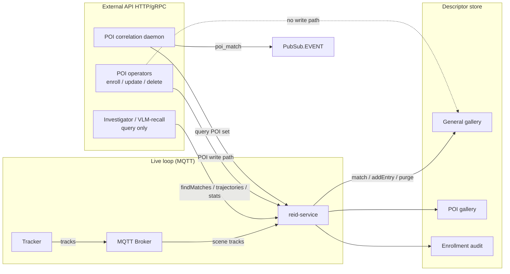

# Design Document: ReID Service — Extraction, API & Capabilities

- **Author(s)**: Derrick Addo, Sarat Poluri
- **Date**: 2026-09-14
- **Status**: `Proposed`
- **Related ADRs**: [ADR 13 — Controller Breakdown into Functionality-Aligned Microservices](../adr/0013-controller-breakdown-microservices.md),
  [ADR 7 — Tracker Service](../adr/0007-tracker-service.md),
  [ADR-10 — ReID Metadata Storage Architecture](../adr/0010-reid-metadata-storage-architecture.md),
  [ADR-11 — Inner-Product ReID State and ID Lineage](../adr/0011-inner-product-reid-state-and-id-lineage.md),
  [ADR 14 — Unified TTL Retention for ReID Descriptor Store Growth](../adr/0014-reid-descriptor-ttl-retention.md),
  [ADR 15 — Hierarchy ReID Provenance and Enrollment Scope](../adr/0015-hierarchy-reid-provenance.md)

---

## 1. Overview

Extract today's in-process ReID library into a standalone `reid-service` (Section 5), and define
the external API and capabilities that service exposes (Section 6). This is the next Controller-
retirement step after Tracker (ADR 7 / ADR 13): ReID gets a durable home outside the Controller
so that responsibility can leave the monolith.

**Live loop:** `reid-service` consumes the Tracker MQTT track stream and matches/stores
internally — no cross-service round trip for live tracking. **External surface:** Section 6 is an
HTTP/gRPC API (query, POI, gallery, trajectory). MQTT request/reply for that external surface
remains open (Section 5.1 / Section 11); it does not reopen the live-loop model.

**Home:** ReID's home is `reid-service`, even if ADR 13's diagram later co-locates it with scene-
state persistence. Packaging/co-deployment can follow; Controllers stop owning ReID when this
extraction lands.

**Inherits (does not reopen):** ADR-10 storage/query semantics, ADR-11 match/output contract,
ADR 14 reclaim-only TTL (schedule moves into `reid-service`; Section 6.8 adds per-collection /
pressure controls), ADR 15 hierarchy enroll/query and provenance (orchestration moves with
extraction; Section 6.5 still chooses the POI correlation feed).

**Adds:** the deployable boundary, Tracker-stream ingest ownership, centralized purge/metrics,
and the external API — baseline `ReIDDatabase` over the network (6.1) plus POI / gallery / TTL /
trajectory capability for the SLP epics (6.2–6.12). Scheduling is Section 9; the contracts are
specified here. Live tracking gallery writes are stream-driven only — no general-gallery write
endpoint in Section 6.

## 2. Goals

- One `reid-service` owns ReID lifecycle, purge, and ReID metrics — not a copy per Controller.
- One external contract, independent of VDMS, Qdrant, or a later adapter.
- External callers can query. POI insert, update, and delete apply only to the POI gallery.
- POI enrollment is all-or-nothing (6.4). POI storage survives container restart via a volume (6.10).
- Trajectory reads return `camera_id` and timestamp within the general-gallery TTL (6.11).

## 3. Non-Goals

- Co-deploying or merging `reid-service` with Scene State Persistence. Home is `reid-service`; packaging can follow.
- A general-gallery write or delete API. Live writes are Tracker-stream ingest only (6.2).
- Image-to-embedding inference inside `reid-service`.
- Stream Manager's video/clip API. It only bounds trajectory retrieval (6.11). Draft: [docs/design/stream-manager](https://github.com/open-edge-platform/scenescape/tree/tdorau/stream-manager-api-draft/docs/design/stream-manager).
- UI, including 2D-track click-through.
- Wire-level OpenAPI/proto. This document specifies behavior; schemas are implementation detail.
- authN/authZ mechanism, and whether POI correlation reuses ADR 15 `DATA_EXTERNAL` (Section 11). Security / trust decisions for POI and query callers are in 6.12.

## 4. Background / Context

### 4.1 Today: ReID is a library, not a service

ReID is a library (`controller.reid`, `controller.reid_registry`, `controller.reid_env`, `controller.reid_constraints`, `controller.vdms_adapter`, `controller.qdrant_adapter`) imported by every controller. `UUIDManager.__init__` calls `create_reid_database` once per tracked category, so one scene process holds several adapters, each with its own TCP connection to VDMS or Qdrant (`REID_HOSTNAME` / `REID_PORT`).

VDMS and Qdrant are already separate containers. The `ReIDDatabase` abstraction, adapters, schema/retention lifecycle, and TIER 1 constraints are not — they run in-process. There is no network boundary between tracking logic and the code that decides how to query or write.

Three call sites, all in `uuid_manager.py`:

| Method         | Call site                    | Trigger                                                             |
| -------------- | ---------------------------- | ------------------------------------------------------------------- |
| `findMatches`  | `sendSimilarityQuery()`      | Enough quality visual features (`assignID()` → `querySimilarity`)   |
| `addEntry`     | `_writeReidEntry()`          | Track goes inactive; features flush (`_addNewFeaturesToDatabase()`) |
| `purgeExpired` | `_purgeExpiredDescriptors()` | Per-process timer; one `UUIDManager` holds `_PURGE_OWNER`           |

Section 5.1 is the target mapping. Today's `_PURGE_OWNER` lock only dedupes purge inside one process, and `DEFAULT_MAX_QUERY_TIME` (4s) disables ReID when in-process query latency drifts. Both retire with extraction.

### 4.2 What's coupled to what

- **Stays with detector ingest:** `moving_object.py` `decodeReIDEmbeddingVector` / `serializeReIDPayload` (detector wire format, not storage).
- **Moves into `reid-service` (5.1):** when to query/write — quality-feature gating, TIER 1 extraction, hierarchy write-health/epoch (`reid_write_healthy`, `reid_write_confirmed`, `reid_write_epoch`, `ReidWriteSupersededError`). The query-latency circuit breaker is not ported.
- **Extracted library:** `reid.py`, `vdms_adapter.py`, `qdrant_adapter.py`, `reid_registry.py`, `reid_env.py`, `reid_constraints.py`.

### 4.3 Problems this creates

1. **No shared lifecycle.** Parent and child controllers each run this layer against one store (ADR 15). Schema creation, purge, and TIER 1 logic are duplicated per process.
2. **No external caller.** Investigator tooling, VLM-recall ([Epic #120](https://github.com/intel-retail/storewide-loss-prevention/issues/120)), and POI ([Epic #221](https://github.com/intel-retail/loss-prevention/issues/221)) cannot reach `findMatches` or POI writes without importing `controller.reid`.
3. **No place to add capability.** POI, deletion, stats, TTL, schema negotiation, and trajectory export have nowhere to live except inside the controller.

### 4.4 What `ReIDDatabase` already provides

`connect()`, `addEntry()`, `getPersistedAttributes()`, `findMatches()`, `findSchemaMetadata()`, `ensureSchema()`, `purgeExpired()`, `retentionEnabled()` — the shared contract both adapters implement. Section 6 exposes it and adds POI, deletion, and per-sighting history. `addEntry` is a tracking side effect (`rvid` on an observed track); it is not a POI API.

### 4.5 Motivating epics

- [Epic #221](https://github.com/intel-retail/loss-prevention/issues/221) — POI enrollment, matching, and alerting. Gallery management and alert routing are left open.
- [Epic #120](https://github.com/intel-retail/storewide-loss-prevention/issues/120) — query API for investigator/VLM-recall tooling; names `Gallery_Size_Active_Persons` and `ReID_Match_Latency_ms` with no source today.

---

## 5. Proposed Design — Part A: Service extraction

### 5.1 Service boundary and transport model

Move the library in 4.2 into `reid-service`. ADR 13: gRPC for synchronous query/response (including Re-ID match/store); MQTT for asynchronous fan-out (including scene tracks).

- **Live `findMatches` / `addEntry` are internal.** Tracker (ADR 7) publishes tracks on MQTT. `reid-service` matches and stores while consuming that stream. Feature gating, TIER 1 extraction, and ADR 15 enroll/query plus write-health/epoch rules move with that orchestration. There is no Controller round trip and no live-loop write endpoint.
- **External match/store is HTTP/gRPC (Section 6).** MQTT request/reply (correlation ID + reply-to) remains an open alternative for this surface only (Section 11): one bus versus a simpler call/return that matches ADR 13.
- **`purgeExpired` is internal.** Delete the Controller timer and `_PURGE_OWNER`. `reid-service` runs `purgeExpired()` on `REID_PURGE_INTERVAL_SECS`. `REID_DESCRIPTOR_TTL_SECS` moves with it. Adapter expiration fields and reclaim-only semantics stay as ADR 14 defined them.

**Live loop:** Tracker publishes scene tracks; `reid-service` matches and stores into the general gallery with no Controller round trip. **External API:** investigator clients query only (6.12); POI operators write only the POI gallery and enrollment audit; the correlation daemon queries like any client and publishes `poi_match` events (6.5). There is no general-gallery write endpoint.

The Controller circuit breaker is not ported: live matching is inside `reid-service`. Degradation signaling (stop using matches; recommend purge/compaction when volume is the cause) is a follow-on and does not block extraction (Section 11).

### 5.2 What doesn't change

Detector-to-Tracker wire format and the inherited ADR-10 / ADR-11 / ADR 14 / ADR 15 contracts (Overview).

### 5.3 ReID metrics separation

Match-latency instruments (`scenescape_controller_reid_*match_latency*`, fed by `MatchLatencyTracker`) move to `reid-service` under its own OTel `SERVICE_NAME`. Timing is internal (stream receipt to decision). Add a separate backend query/write duration so a slow VDMS/Qdrant call is distinguishable from upstream delay.

`record_reid_current_camera_count` and the tracked-object counts come from `CameraRegistry` / `TrackedObjectRegistry`. They leave the Controller before Phase 7; the service that owns those registries owns the metrics. They are not a Controller exception through retirement.

### 5.4 Tracker stream contract (live ingest + trajectory fields)

`GET /trajectories/{gid}` (6.11) reads what this ingest persists. It does not define a write API.

Against current Tracker code:

- **Embeddings are best-effort passthrough.** If a detector sets `metadata.reid` (including `embedding_vector`), Tracker preserves it (`Detection::metadata_json` → `TrackPublisher::serialize` on `scenescape/data/scene/{scene_id}/{category}`). It is not a required `Track` field. Multi-camera metadata fusion is confidence / last-write-wins. There is no guaranteed embedding-on-track contract for live matching.
- **`camera_id` and per-sighting timestamp are missing** on published tracks. Input batches have `DetectionBatch.camera_id`; the scene envelope has a message timestamp; objects have world `translation` / `size`. Schema allows optional `visibility` / `camera_bounds`; `TrackPublisher` does not emit them. Pixel bbox is not required for Stream Manager (6.11).
- **Today's ReID write never stores them.** `UUIDManager` persists `_extractSemanticMetadata()` only. `self.location` (`Chronoloc`: point, timestamp, bbox) is unused on that path. `_extractCameraId()` feeds a metrics counter, not the gallery write.

**Required:** the Tracker payload `reid-service` consumes includes `camera_id` and per-sighting `timestamp`, and `reid-service` stores both on each descriptor write. Closing that gap is Tracker (or detector) work (Section 11). How far back a query can see is the general-gallery TTL (6.11).

---

## 6. Proposed Design — Part B: External API & capability surface

Section 5 is the service. This section is the first network API on `ReIDDatabase`, for callers other than the live loop. Transport is HTTP/gRPC unless Section 11 picks MQTT request/reply.

### 6.1 Baseline service API surface

Thin wrappers over today's methods. No behavior change.

- **`findMatches`** — external query (6.3).
- **`findSchemaMetadata`** — collection existence, dimensions, metric.
- **`purgeExpired`** — optional manual trigger. Scheduled purge is internal (5.1).
- **Health/readiness** — new; the in-process library had none.

### 6.2 Design principles

- **One contract per backend.** Same endpoints, shapes, and success rules. If an adapter lacks a primitive (for example count), the service implements it. Callers do not branch on VDMS vs Qdrant.
- **Writes are POI-gallery only.** Insert, update, and delete are 6.4 and 6.7. Query (6.3) may read both galleries and never writes. General-gallery aging is the 24h TTL (6.7).
- **POI records are persisted, not long-TTL.** See 6.10. `poi_id` is server-generated.
- **Security / trust.** Privilege split, deployment scope, gallery isolation, enrollment audit, and write rate limits are 6.12.

### 6.3 Query API

Expose `findMatches` to investigator tools, VLM-recall (Epic #120), and POI matching (Epic #221), with the same TIER 1 constraints (`reid_constraints.py`) as query parameters. No new adapter logic.

### 6.4 POI enrollment (insert and update)

`POST /poi` accepts precomputed embeddings plus `severity`, `notes`, and `enrolled_by`. It does not take raw images or a client `poi_id`. Internally it uses the `addEntry` write path without inventing an `rvid`. Who runs image → embedding for a one-off enrollment (ephemeral DL Streamer pipeline vs a synchronous extract API) is open (Section 11).

`enrolled_by` is required on every enroll and embedding append. Immutable enrollment audit and write-path rate limits are specified in 6.12; mechanics here: each enroll/append appends an audit record (`enrolled_by`, timestamp, vector id or hash). Metadata PATCH and deactivate do not rewrite or remove prior records. Hard delete (6.7) removes the POI from the matchable gallery but must not erase the audit trail.

Updates:

- `POST /poi/{poi_id}/embeddings` — append a reference embedding (Epic #221: 1–5 per POI).
- `PATCH /poi/{poi_id}` — metadata only, including active/inactive. Hard delete is 6.7.

**Write contract.** `POST /poi` and embedding appends succeed only when every vector in the request is accepted. Otherwise the call fails and no half-enrolled `poi_id` is returned. That is stricter than general-gallery partial writes (`ReidPartialWriteError`). It is not fsync, quorum, or durability. Persistence is 6.10. Adapter confirmation (Qdrant `wait=True`, VDMS per-descriptor status) stays internal; callers see one outcome.

POI embeddings use their own collection/`set_name`, not the general gallery: different retention (6.8), and queries name the POI set vs the general set instead of inferring it from `object_type`. Validate with `prepareReidDict` / `prepareReidVector`; reject with `ReidNoValidVectorsError`.

### 6.5 POI correlation and alert delivery

Correlation is a daemon that calls `reid-service` like any other API client. Checking the POI set inside `UUIDManager` is rejected (Section 7): it would put POI logic back in the Controller.

**Feed.** `publishExternalDetections` already puts `embedding_vector` and `reid_provenance` on `PubSub.DATA_EXTERNAL` (ADR 15). That topic is rate-limited and gated by `_hierarchyReidPublishPolicy` (write ownership, not "should POI see this"). `DATA_SCENE` does not carry embeddings. Reuse vs a dedicated publish path is open (Section 11). Once `{gid: poi_id}` is set, it sticks for the life of the `gid`.

**Event vs delivery.** The daemon publishes `poi_match` on `PubSub.EVENT` (Epic #221 payload: `poi_id`, `camera_id`, confidence, bbox, timestamp). Hierarchy `republishEvents` forwards it. Delivery stays on that daemon, off the match path — not a second service. Epic #221's 3s target and multi-destination fan-out must not block correlation, and the 5-minute dedup window is notification policy, not match history.

**Transports.** MQTT subscribe plus a configurable REST webhook. Message-queue delivery when an integration needs it.

The daemon owns `POI_Match_Latency_ms`. `reid-service` reports generic query latency only.

### 6.6 Gallery and collection management

Neither adapter exposes count or list today. `findSchemaMetadata` does not return size. VDMS has no `count` comparable to Qdrant; both adapters must grow that capability so the external stats API stays the same.

- `GET /collections` — name, dimensions, metric, retention. Not which backend is deployed.
- `GET /collections/{name}/stats` — `vector_count` and `distinct_object_count` (1–5 embeddings per POI; general gallery also stores more than one vector per UUID). `Gallery_Size_Active_Persons` is the distinct count.
- `POST /collections` — explicit create for POI collections (name, dimensions, metric, retention). The general gallery keeps lazy `ensureSchema`.

Whether stats accept `scene_id` / `camera_id` is open (Section 11). Export size as an OTel gauge for `GalleryExtractor`, not only as a REST body (Section 10).

### 6.7 Deletion (POI gallery only)

New `deleteEntry`. Delete by `poi_id` and by filter (`severity`, enrollment date), reusing `reid_constraints.py`. Removes the POI from the matchable gallery. Enrollment audit retention is 6.12.

The general gallery is not deletable through this API. It ages out on the ADR 14 TTL (default 24h). Further purge, compaction, or an explicit erasure path can be added later and does not block this endpoint.

### 6.8 TTL and eviction

General-gallery contract stays ADR 14: `REID_DESCRIPTOR_TTL_SECS` (default 24h; `0` disables), reclaim-only `purgeExpired`, adapter-private expiration. The schedule moves in 5.1.

Once POI collections exist (6.4, 6.6):

- **Per-collection TTL.** POI retention is per collection, not one TTL per process. Reclaim-only semantics for the general gallery stay.
- **Pressure eviction.** Oldest-first once a collection crosses a size cap, in addition to TTL. ADR 14 deferred capacity eviction; this is that follow-on.

### 6.9 Schema declaration

Dimensions are inferred from the first write (`_ensureReIDDimensions` → `ensureSchema`). External callers may query before any write. Add an explicit declare-dimensions-and-metric call for a collection.

### 6.10 POI persistence

The general gallery is repopulated by live tracking. POI is not: a lost record is a silent gap until someone re-enrolls.

**Shipping bar:** a Docker volume or Kubernetes `PersistentVolumeClaim` on the POI collection's backend data. Container restart, image update, or pod recreate must not wipe it. No adapter change. Host or disk loss, replication, and multi-AZ durability are out of scope.

Enrollment success is the 6.4 write contract, not a durability guarantee.

No export or live-migration API. Volume loss or a VDMS↔Qdrant swap means manual re-enrollment. A later dump could serve backup and offline migration; it is not required here.

### 6.11 Trajectory export

`reid-service` returns an ordered sighting list. Video is Stream Manager. UI click-through is out of scope (Section 3).

Ingest of `camera_id` and per-sighting `timestamp` is 5.4. No write endpoint.

`GET /trajectories/{gid}` returns one entry per descriptor write: `camera_id` and `timestamp`, chronological. This is not `getPersistedAttributes` (latest-only).

| Concern                                                               | Owner               | Contract                                                                                                  |
| --------------------------------------------------------------------- | ------------------- | --------------------------------------------------------------------------------------------------------- |
| Sighting diary (`camera_id`, `timestamp`)                             | `reid-service`      | `GET /trajectories/{gid}`                                                                                 |
| Attach, buffer, record, list                                          | Stream Manager      | `/v1/streams`, `/v1/records/start\|stop`, `GET /v1/records`                                               |
| Frame or clip                                                         | Stream Manager      | `GET /v1/records/{id}/frame?stream-id&timestamp`; `GET /v1/records/{id}/clip?stream-id&timestamp-start&…` |
| Map `camera_id` to `stream_id` / `sensor_id`; record vs query; stitch | Business logic / UI | Outside both APIs                                                                                         |

Stream Manager seeks by `stream-id` plus RFC 3339 time on NTP-synced streams. It does not take frame number or bbox, and it returns per-stream media, not a stitched multi-camera video. Those two facts fix the ReID sighting contract: camera + timestamp only.

Retention is the general-gallery TTL (default 24h). The API cannot return purged sightings. There is no longer-lived trajectory store.

Size the `reid-service` piece (5.4 fields plus this endpoint) separately from Stream Manager integration (id mapping, record lifecycle, multi-clip UI).

### 6.12 Security / trust model

Policy for the external API (Section 6). The authN/authZ _mechanism_ (tokens, mTLS, gateway policy, etc.) remains open (Section 11) and must land before `POST /poi` or delete ship (Section 9). MQTT trust for the Tracker subscription is a separate open (Section 11).

- **Query principals cannot write.** Investigator / VLM-recall clients (Epic #120) get query, trajectory, and stats only. They must not be authorized for POI enroll, embedding append, metadata PATCH, or delete. POI write verbs are a separate privilege for operators / enrollment automation that drive safety alerts (Epic #221).
- **Same service, separate privileges.** One `reid-service` instance may serve both Epic #120 and Epic #221. Privilege separation is the trust boundary, not a second deployment.
- **POI scope is the deployment, not a scene.** Insert, update, and delete apply to that deployment's POI gallery. There is no per-scene POI write key; an enrolled POI is visible / matchable wherever that deployment's correlation and query clients run. Isolation across customers or sites is a separate deployment (or equivalent hard partition), not a `scene_id` on the write API.
- **POI writers cannot poison regular track entries.** A principal with POI write permission has no API path to insert, update, or delete general-gallery (live track) descriptors — those writes are Tracker-stream ingest only (6.2). POI and general galleries must not share a writable collection or set.
- **Immutable enrollment audit.** Every enroll and embedding append records `enrolled_by`, timestamp, and vector id or hash (6.4). PATCH and deactivate do not rewrite history. Hard delete removes the matchable POI but keeps the audit trail (6.7). That is the v1 control for authorized-writer POI misuse. No inactive-by-default gate, dual-control activate, or elevated-delete role in this design. `enrolled_by` is attribution, not content integrity: an authorized writer can still enroll a misleading embedding. Semantic proof that an embedding is the intended person is out of scope for `reid-service`.
- **Write-path rate limits.** Apply to POI insert, embedding append, PATCH, and delete so a compromised client that holds write credentials cannot flood enrollments or deletes (DoS / resource exhaustion). Rate limits do not decide whether a given vector is a truthful enrollment.

---

## 7. Alternatives Considered

| Alternative                                                                   | Why it does not fit                                                                                     |
| ----------------------------------------------------------------------------- | ------------------------------------------------------------------------------------------------------- |
| Keep ReID in-process and add a Controller HTTP facade                         | Does not fix cross-hierarchy lifecycle (4.3). Every ReID change stays a Controller release.             |
| Extract only the VDMS/Qdrant adapters                                         | Splits one contract across the network. TIER 1 and validation belong with the adapters.                 |
| Controller holds a synchronous RPC client to `reid-service` for the live loop | Live matching has no cross-service caller (5.1). Couples the Controller to `reid-service` availability. |
| POI check inside `UUIDManager`'s per-frame loop                               | Lowest latency, and it puts POI logic back in the Controller (6.5).                                     |
| Reuse ADR 15 `DATA_EXTERNAL` as-is for the correlation feed                   | Open (Section 11). The alternative is a dedicated publish path not gated by write-ownership policy.     |

## 8. Consequences

- The Controller circuit breaker is not ported. Degradation signaling is a follow-on (Section 11) and does not keep ReID in the Controller.
- Trajectory persistence waits on Tracker publishing `camera_id` and per-sighting timestamp (5.4).
- POI data survives container restart only via a volume. Enrollment success is the 6.4 contract. There is no export or automated backend migration.

## 9. Rollout / Migration Plan

Ship `reid-service` behind a flag, dual-run against in-Controller ReID until parity gates pass, then delete the in-Controller path (ADR 13, same shape as Tracker). Env for TTL and purge interval, hierarchy write-health handoff, and metrics cutover are implementation details of that phase.

Section 6 sequencing:

- 6.1 before any other API.
- authN/authZ mechanism (Section 11) before `POST /poi` or delete ship; policy is 6.12. Tracker-subscription trust stays a separate open.
- 6.8 after 6.4 and 6.6 (a collection must exist before it has a TTL).
- 6.11 after Tracker publishes `camera_id` and per-sighting timestamp (5.4). Stream Manager integration follows that, not the other way around.

Other Section 6 subsections can be scheduled independently against Epic #221 or Epic #120.

## 10. Testing & Monitoring

Test new adapter behavior (per-collection TTL, count/list, trajectory query, 5.4 fields) through `ReIDDatabase` on both backends, plus transport-level tests for 6.1.

OTel, not REST-only: match latency and backend duration (5.3), `Gallery_Size_Active_Persons` / `POI_Gallery_Size` (6.6), `POI_Match_Latency_ms` on the correlation daemon (6.5).

## 11. Open Questions

**Extraction**

- **External transport.** Section 6 is specified as HTTP/gRPC, matching ADR 13. MQTT request/reply for that surface only is still open (5.1).
- **Degradation signaling.** Detect degraded query performance so consumers stop using matches; when the cause is gallery volume, recommend purge or compaction. Signals, thresholds, and the consumer contract are not designed yet. Does not block extraction.
- **Tracker stream gaps (5.4).** No guaranteed embedding on published tracks. `camera_id` and per-sighting timestamp are not published. Bbox is not required. Live matching and trajectory writes cannot rely on the stream until a guaranteed embedding, `camera_id`, and per-sighting timestamp are published.
- **MQTT trust for the Tracker subscription.** Broker ACL, topic auth, network policy, or a combination. Distinct from endpoint authN/authZ below.

**API**

- **Enrollment embedding extraction.** Ephemeral DL Streamer pipeline vs a synchronous extract API (6.4).
- **Correlation feed.** ADR 15 `DATA_EXTERNAL` as-is vs a dedicated path (6.5).
- **Stats scope.** Whole-collection `GET /collections/{name}/stats` vs `scene_id` / `camera_id` filters for v1 (6.6).

**Security**

- **authN/authZ mechanism.** How principals and the read-vs-write split in 6.12 are enforced (tokens, mTLS, gateway policy, etc.). Required before `POST /poi` or delete ship (Section 9). MQTT trust for the Tracker subscription is listed under Extraction above.

## 12. References

- [ADR 13 — Controller breakdown](../adr/0013-controller-breakdown-microservices.md), [ADR 7 — Tracker](../adr/0007-tracker-service.md), [ADR-10](../adr/0010-reid-metadata-storage-architecture.md), [ADR-11](../adr/0011-inner-product-reid-state-and-id-lineage.md), [ADR 14](../adr/0014-reid-descriptor-ttl-retention.md), [ADR 15](../adr/0015-hierarchy-reid-provenance.md)
- [Epic #221](https://github.com/intel-retail/loss-prevention/issues/221), [Epic #120](https://github.com/intel-retail/storewide-loss-prevention/issues/120)
- [Stream Manager design draft](https://github.com/open-edge-platform/scenescape/tree/tdorau/stream-manager-api-draft/docs/design/stream-manager)
