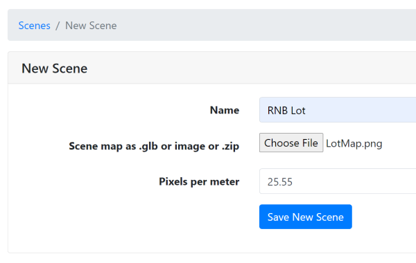
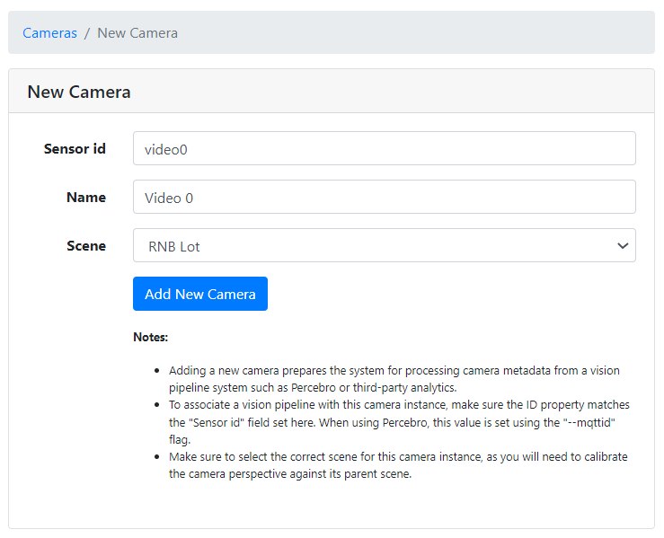
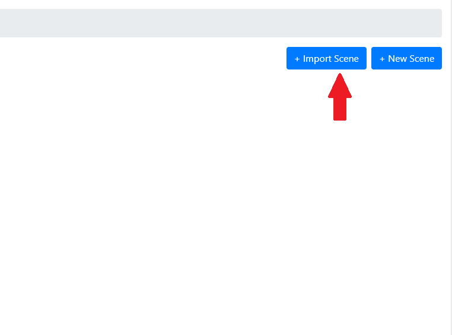

# How to Create and Configure a New Scene

Once the demo scene is running, the system is ready to process a live scene. There are a few things that need to be done to configure a live scene in Intel® SceneScape. These include:

1. [Mounting and connecting cameras](#mounting-and-connecting-cameras)
2. [Configuring the vision pipeline for each camera](#configuring-the-vision-pipeline-for-each-camera)
3. [Creating a scene floor plan](#creating-a-scene-floor-plan)
4. [Adding the new scene and cameras](#adding-the-new-scene-and-cameras)
5. [Exporting and Importing the scene](#exporting-and-importing-the-scene)

Before getting into the actual setup, let's review a couple of reference configurations that we will be using.

## Audience

This document is for users familiar with basic TCP/IP networking, connecting USB or networked cameras, editing text configuration files on Linux, and using the Linux terminal.

## Camera Selection Considerations

Here are several considerations when selecting a camera.

- **Use cameras with a diagonal field of view (DFOV) of 80 degrees or less.** Wider fields of view may provide better camera coverage, but these cameras usually exhibit distortion that requires careful calibration and processing to mitigate. Avoid this if possible by selecting a camera with a DFOV of 80 degrees or less. Refer to the camera datasheet for field of view information, such as the diagonal or horizontal and vertical fields of view.
- **Use HD (1080p) or lower resolution.** High resolution (4k or 8k) may result in lower frame rates and no improvement to accuracy. Most deep learning models take a smaller input, so the additional resolution may not be used, costs more bandwidth and latency to transmit, and takes more compute to resize the frames.
- **Pay attention to aspect ratio.** While most cameras operate at 16:9 aspect ratio by default, selecting a different resolution may result in a different aspect ratio. For example, an 800x600 image has a 4:3 aspect ratio, which is a smaller field of view than the 16:9 aspect ratio feed from the same camera.

### Determining camera field of view

Each camera must have a known field of view, since it is used by Intel® SceneScape to project data into the digital scene. The field of view is usually published in the camera's datasheet.

> **Note:** Point/Tilt/Zoom (PTZ) cameras have a varying field of view depending on the zoom level. We recommend setting the zoom level to the widest setting so the field of view can be read from the datasheet. Zooming in will require careful measurement of the field of view or camera intrinsics calibration, a process not documented here.

Determine either the diagonal field of view or the horizontal and vertical fields of view. For example, the datasheet might report a diagonal field of view of 73°, or it might state a horizontal field of view of 71° and a vertical field of view of 40°.

## Reference Configurations

There are many ways to configure Intel® SceneScape to process camera and sensor data. Here we we will focus on two configurations, each with two cameras. Configuration 1 uses USB cameras connected to the same computer, and Configuration 2 uses IP cameras connected to different computers. You can use these two configurations as the starting point for building custom scenes with multiple cameras and compute nodes.

### Configuration 1: USB cameras with a single computer


**Figure 1:** Live Configuration 1 with USB cameras and a single computer

Any UVC-class camera should work, but this configuration is tested with Logitech C922 USB web cameras. Be sure to follow the manufacturer's recommendation when connecting these cameras, particularly if you need to use USB extensions.

### Configuration 2: IP cameras with multiple computers


**Figure 2:** Live Configuration 2 with IP cameras and multiple computers

For Configuration 2, we show how to configure multiple computers to run the scene using IP cameras. Note that it is not necessary to use multiple computers, but in some cases it may be advantageous to split the workloads up across available compute nodes.

The cameras in this configuration can be any IP camera that supports RTSP or MJPEG. This configuration is tested with the Axis M5x series of PTZ PoE cameras. Since MJPEG has lower latency, we will be showing how to configure these cameras using MJPEG.

Refer to the manufacturer's documentation for your camera to determine the correct connection URL and protocol.

Three Gen 8 Intel Core i5 or better computers are sufficient for this configuration.

## Mounting and Connecting Cameras

Once you have selected the configuration and cameras, it's time to mount them in a good spot for monitoring the scene and connect them up to the computer or network.

A good rule of thumb is to mount the cameras above any object or person to be monitored and angle them down by at least 30 degrees.


**Figure 3:** Camera mounting angle

> **Note**: If possible, avoid mounting the cameras with a view of the horizon, or at least keep most of the area to be monitored well below the horizon by angling the camera down and mounting it higher.

Once the cameras are mounted and connected, verify that the cameras are working using webcam software (such as Cheese on Linux), VLC, or a web browser per the manufacturer's instructions. If using USB cameras, be sure to quit any application using the camera prior to connecting to the camera with Intel® SceneScape.

## Configuring the vision pipeline for each camera
Refer to [How to Configure DLStreamer Video Pipeline](How-to-configure-dlstreamer-video-pipeline.md)

### Setting up IP cameras and computers in Configuration 2

Recall that in Configuration 2 we are using multiple IP cameras and multiple computers. Before configuring any cameras, install Intel® SceneScape on each computer and verify that they are all running the demo scene(s) independently.

Make sure all systems are connected to the network. Note the hostname or IP address of each camera and computer and the associated usernames and passwords. In this document we will show how to configure the systems by IP address.

Make sure all Intel® SceneScape microservices are stopped on all computers using `docker-compose down`.

#### Scene Controller configuration

On the scene controller system, edit `docker-compose.yml` and remove or comment out any `video` services. We will not be running the video pipeline on this system, but the rest of the services are needed.

#### Video pipeline configuration

Copy the entire secrets folder from the scene controller to each of the other computers. This will allow the services running on the video pipeline computers to authenticate with the scene controller.

For example, from the terminal on each of the video pipeline computers run the following command from within the Intel® SceneScape project directory:

```
~/scenescape$ rsync -aP <user>@<scene_controller_IP>:scenescape/manager/secrets .
```

On the computers running the video pipeline for each IP camera, edit `docker-compose.yml` and remove all services _except_ the `video` services.

On the computers processing the video feeds, configure docker-compose.yml to connect Percebro to each IP camera. In this case we will use the MJPEG URL for the Axis M50xx series of cameras. This URL will vary by camera manufacturer. Here is an example (be sure to update the values in <> brackets):

```
  video:
    image: scenescape:<version>
    networks:
      scenescape:
    extra_hosts:
     - "broker.scenescape.intel.com:<ip_of_scene_controller>"
    depends_on:
     - broker
     - ntpserv
    #  - ovms # Need to uncomment this to use ovms
    command:
     - "percebro"
     - "--camera=http://<user>:<password>@<camera_ip>/axis-cgi/mjpg/video.cgi"
     - "--cameraid=<camera_id>" # e.g. "video0" or "video1", depending on the camera
     - "--intrinsics={\"fov\":70}"
     - "--camerachain=retail"
     - "--ntp"
     - "ntpserv"
     - "--auth"
     - "/run/secrets/percebro.auth"
     - "broker.scenescape.intel.com"
    privileged: true
    volumes:
     - ./:/workspace
     - vol-models:/opt/intel/openvino/deployment_tools/intel_models
    secrets:
     - certs
     - percebro.auth
    restart: on-failure
```

> **Notes:**
>
> - Confirm that you have added the `extra_hosts:` configuration, since it is not in docker-compose.yml by default.
> - Multiple Percebro services can run on each system (similar to Configuration 1 above), but the service name and mqttid for each must be unique.
> - Use the same method used in Configuration 1 to set the camera fields of view (fov).

Save docker-compose.yml on each system.

## Creating a scene floor plan

Creating an accurate floor plan image may be as simple as using a CAD drawing or a satellite map view. The most important aspects are:

1. Making sure that there are details in the map to calibrate cameras against
2. Determining the scale of the image in pixels/meter

For best results, size the image to about 1000 pixels wide. The scale to set when creating the scene is the pixel width of the image divided by the width of the scene in meters. For example, if the image is 960 pixels wide and that corresponds to 12 meters across the scene, the scale is `(960 pixels) / (12 meters) = 80 pixels per meter`.

There are other methods of determining pixels per meter, such as measuring the distance between two known points in pixel units on the image and in meters on the scene. Some math involving the Pythagorean theorem may be required.

> **Note**: Creating accurate scale floor plans and calibrating cameras can be challenging. To assist with this process, Intel® SceneScape supports importing a scene that was scanned with a mobile device or uploading a glTF (.glb) 3D asset of the scene. For more information on scene scanning and using scene scans for automated camera calibration, see [Markerless Camera Calibration](How-to-autocalibrate-cameras-using-visual-features.md#1-generate-polycam-dataset).

### Scene floor plan example

Consider this sample parking lot floor plan image that is modeled off of a [parking lot at Intel Corporation](https://www.google.com/maps/@37.3882958,-121.9644111,44m/data=!3m1!1e3):


**Figure 4:** A sample parking lot floor plan

Using a mapping tool, it is possible to measure various distances between points. In this case, the measurement between the center line on each parking row is 61.01 ft (18.59 m). On the image, that same distance corresponds to 475 pixels as measured using a select tool in a basic image editor. The scale of this image is then `(475 pixels) / (18.59 meters) = 25.55 pixels per meter`.

### Adding the new scene and cameras

From the Intel® SceneScape working directory on the scene controller, bring up the system with the new configuration:

```
$ docker compose up
```

If you are using Configuration 2, also run `docker compose up` on each additional computer.

Launch Intel® SceneScape and log in. Create a new scene by clicking on "Scenes" in the navigation menu, and then clicking on "+ New Scene". Give your scene a name, select your floor plan file, and enter the scene's scale. Using the above parking lot example, it might look something like this:



**Figure 5:** Creating a new scene

Click "Save New Scene" and then open the scene by clicking on it in the Scenes page.

Add each camera by clicking on "+ New Camera" below the scene map, then filling in the camera details as required.

> **Note**: The camera ID _must_ match the `cameraid` set in docker-compose.yml, or the scene controller will not be able to associate the camera with its instance in Intel® SceneScape.

Using the above example, the form should look like this for the `video0` camera:



**Figure 6:** Creating and calibrating a new camera

Once both cameras are added, the scene is ready to be calibrated. Click on each camera and follow the instructions [here](How-to-manually-calibrate-cameras.md) to calibrate each. Test the system by walking around in the camera view and verify that the dots representing each person appear in the correct place on the floor plan. For Auto Calibration of cameras, use one of these methods: [Apriltag Calibration](How-to-autocalibrate-cameras-using-apriltags.md) or [Markerless Calibration](How-to-autocalibrate-cameras-using-visual-features.md).

### Exporting and Importing the scene

Intel® SceneScape provides a way to easily transfer a scene configuration from deployment to another through export and import functionality. This greatly reduces time, effort and discrepancies between development and deployment configuration of a scene.

#### Exporting the scene

Launch Intel® SceneScape and log in.

Select the scene you'd like to export.

In the upper-right corner of the scene home page, click on the `Export <scene_name>` button (next to the 3D toggle).


A ZIP file `<scene_name>.zip` will be downloaded.

> **Note**: Zip file includes a JSON and resource file (either an image or gltf). If cameras were calibrated using the 2D UI, map points and camera points will be preserved during importing. Otherwise, the camera transform will default to Euler format.

#### Importing the scene

Launch Intel® SceneScape and log in.

Import a new scene by clicking on "Scenes" in the navigation menu, and then clicking on "+ Import Scene".



Upload the appropriate zip file.

click import to begin the upload.

> **Note**: If your ZIP includes a .gltf map file, the upload process may take longer depending on the file size.
