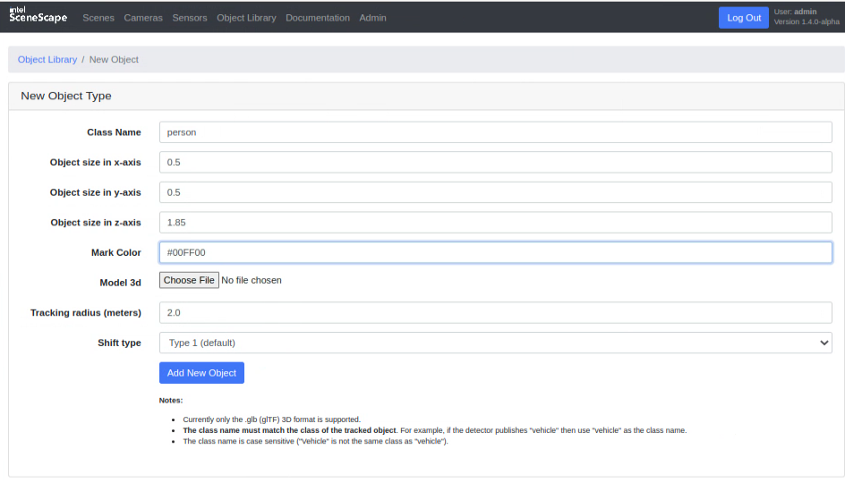
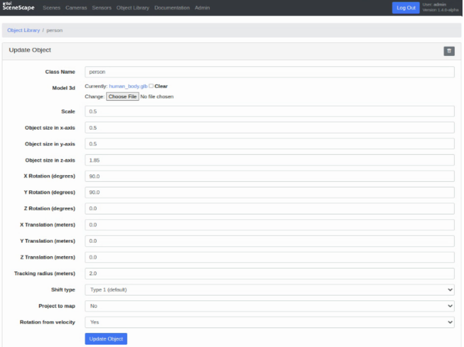
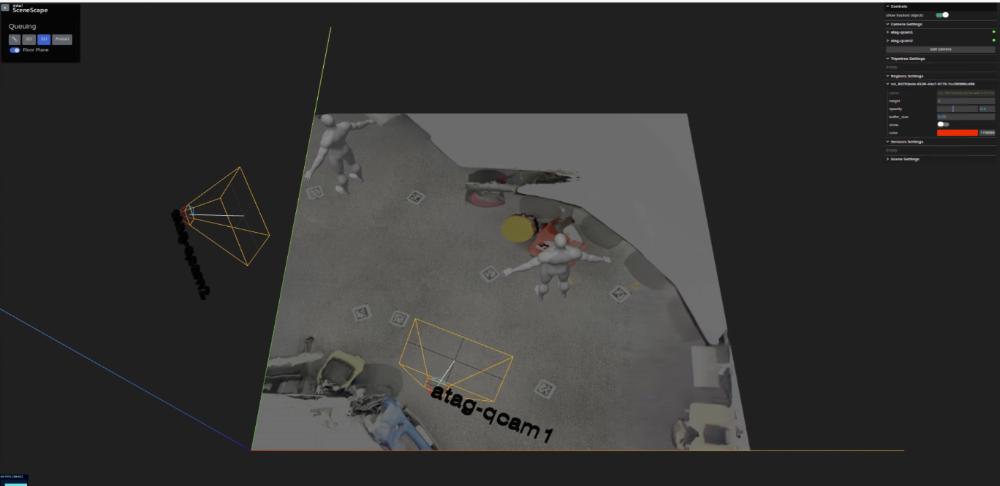

# How to Define Object Properties

The Object Library allows you to configure various properties for object categories in SceneScape. This guide walks through the process of defining and customizing object properties.

## Working with the Object Library

1. Navigate to the SceneScape homepage.
2. Click on the Object Library link in the top navigation bar.

### Add a New Object

1. Click on "New Object".
2. Input the object properties.
3. Click on "Add New Object".

### Update Existing Object

1. Click on the wrench/spanner icon in the Update column in the row of the object to be edited.
2. Edit the object properties.
3. Click on "Update Object" to save any changes.

## Basic Object Properties

### Size Configuration

- **Object size in x-axis**: Define the width of the object in meters
- **Object size in y-axis**: Define the length of the object in meters
- **Object size in z-axis**: Define the height of the object in meters

### Buffer Size Configuration

Buffers allow you to expand or shrink the bounding box around objects. This is particularly useful when:

- Working with pre-trained models that may not detect the entire object
- Adjusting detection boxes that are either too tight or too loose
- Creating custom visualization or collision zones

You can apply positive values to expand the bounding box or negative values to shrink it along any axis:

- **Object buffer size in x-axis**: Define the buffer width of the object in meters
- **Object buffer size in y-axis**: Define the buffer length of the object in meters
- **Object buffer size in z-axis**: Define the buffer height of the object in meters

### Tracking Behavior Settings

- **Tracking radius (meters)**: Set the maximum distance from the object center for matching new detections with the track.
- **Shift type**: Shift type is used to compute the bottom center of the object to estimate its position in world coordinates.
  - For most objects the default setting of "Type 1" will work well.
  - For wide and short objects, "Type 2" performs better.

## Additional Settings

- **Rotation from velocity**: When enabled, orientation of the object is inferred from the computed velocity.
- **Project to map**: When enabled, objects will be projected onto the map surface.

## 3D Model Configuration

By default, the shape of the object is a cuboid. Instead, the user can provide a 3D asset file (.glb) for 3D visualization.

1. Click on "New Object" or click on the wrench/spanner icon in the Update column in the row of the object to be edited..
2. Choose a .glb file with the file picker input.
3. Edit any of the asset property fields.
4. Click on "Add New Object" or "Update Object"

### Asset Properties

1. **Scale Adjustment**:
   - Use the scale value to resize the model uniformly along X, Y, and Z axes.

2. **Orientation Adjustment**:
   - Rotate the 3D asset along X, Y, and Z axes to set the default orientation.

3. **Position Adjustment**:
   - Adjust the default position of the 3D asset wrt origin.

### Verify Results

1. Navigate to the 3D UI of a Scene.
2. Instead of the default cuboid, the uploaded 3D asset (.glb) will represent the tracked object.

